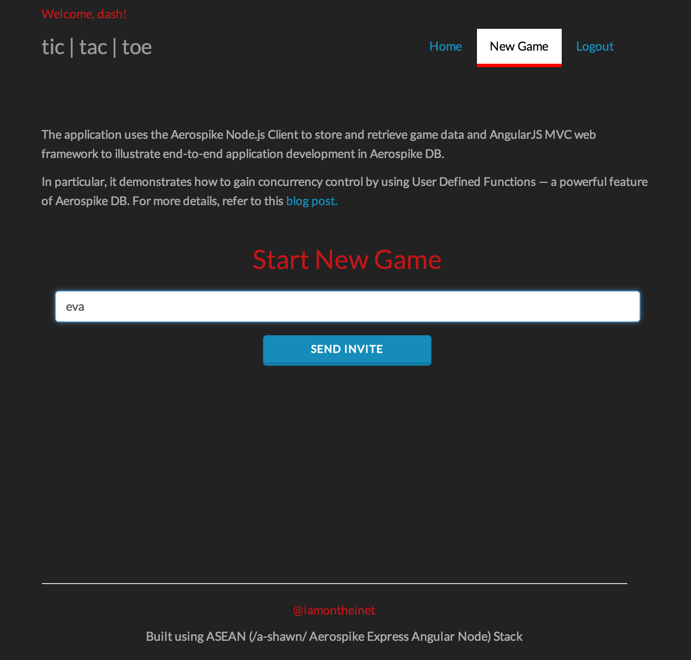
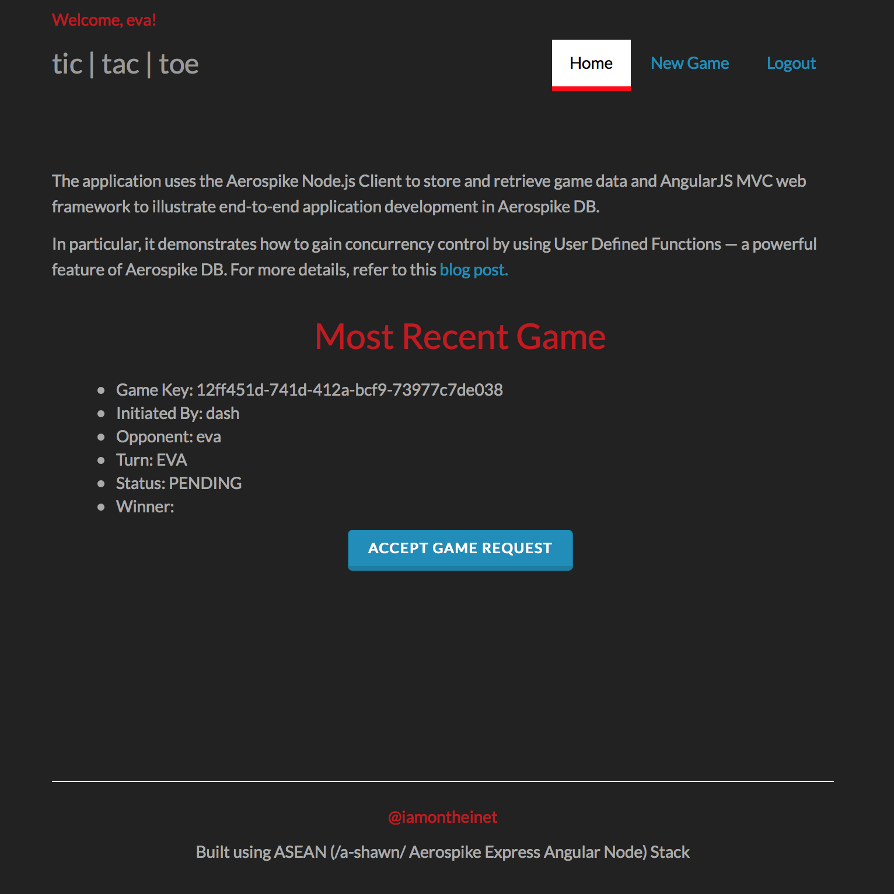
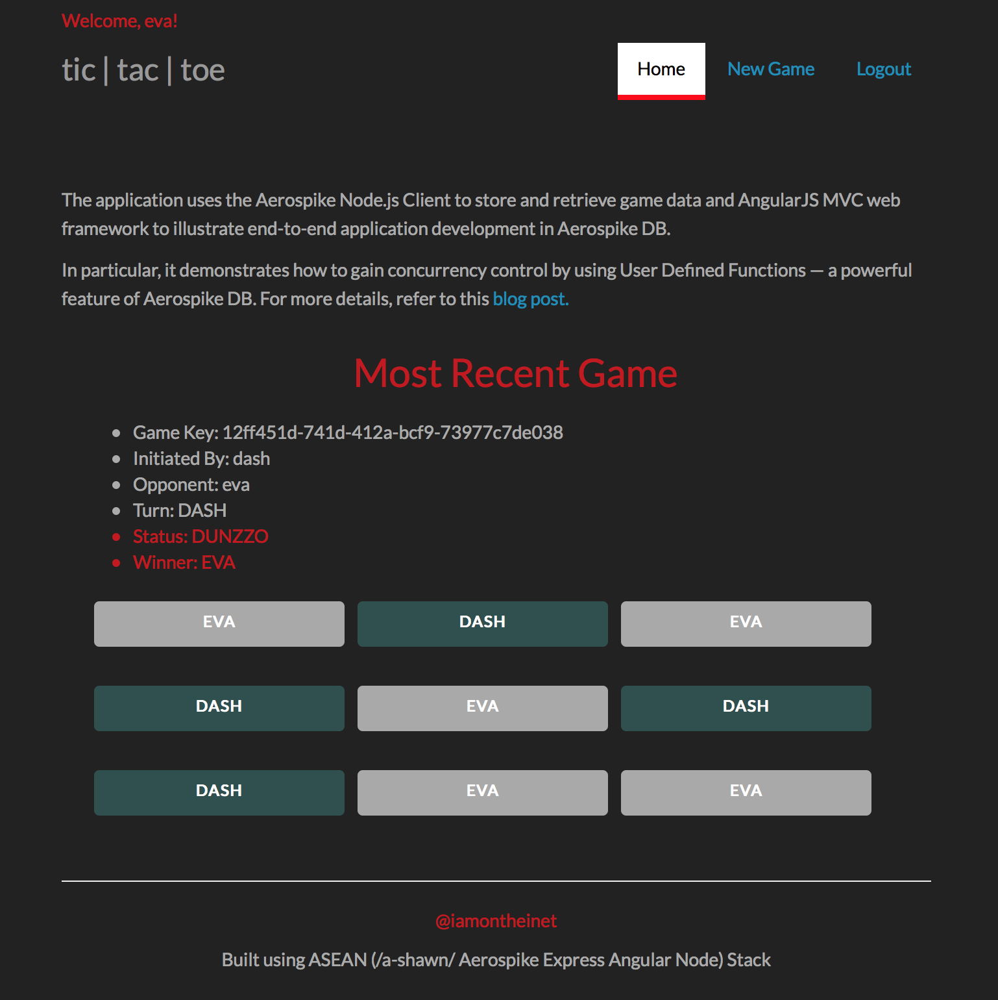

# Tic | Tac | Toe

This is a web-based game with multiple players playing against each other at the same time. This application uses the Aerospike Node.js Client to store and retrieve game data and AngularJS web framework to illustrate end-to-end application development in Aerospike DB.

Concurrency control is one of the main aspects of multi-player games where all the checks, conditional writes and game state updates must be made as fast as possible and with minimal client/server calls in order to keep the game fair and square. This is especially critical in turn-based games where careless implementation (such as putting code that alters the game state in the client) can lead to concurrency related "race condition" from creeping in.

For example, consider a tic-tac-toe game between John and Jane. If John played three moves simultaneously by opening different browser windows before Jane played her turn, sequence of updates would result in John winning the game by way of “cheating.” Good for John but not so much for Jane! (Till she figures out the same technique… yea, John!)

In this application, concurrency control is achieved by putting conditional writes and game state updates on the server using User Defined Functions. UDFs are a powerful feature of Aerospike DB and they can be used to extend the capability of the Aerospike DB engine both in terms of functionality and performance. For more information on UDFs, [click here](http://www.aerospike.com/docs/guide/udf.html).

## Prerequisite

- [Aerospike Server](http://www.aerospike.com/download/server/latest) – The server should be running and accessible from this app.

## Technical Know-How

Even though this is a pretty lightweight application, I’ve used different technologies to make it decent enough - *visually & functionally* - and covering all aspects as well as walking through the entire codebase is beyond the scope. So, good understanding and working knowledge of the following technologies is presumed.

* Node.js
* AngularJS
* Aerospike DB
* Lua
* Express
* Socket.io

## Application At A Glance 

At a higher-level, here’s what happens -- after creating an account and/or logging into an existing account, a user can:

1. Start a new game by inviting someone to play
2. Accept (pending) invite to play

**NOTE**: Users are notified of new game invites in real-time via Socket.io. Therefore, in this version of the application both users must be logged in to see the invites. In the future, I will enhance the app such that users will be able to see all pending invites as well as games they've already played. Stay tuned!

**As the game progresses with every move, here’s what must happen in order to keep the game fair and square:**

1. The following conditions must be checked:
    
    *  Is the game already over? If so, is there a winner and who won?
    *  Is it current user's turn?
    *  Is the selected square already taken?

2. If the above three conditions result in *NO*, *YES*, *NO* respectively, the state of the game needs to be modified as follows:
    
    *  Selected square's value needs to be set to current user's username
    *  Value of *turn* needs to be swapped out to the other user
    *  Record needs to be updated in the database to reflect this state

3. Then, taking into account the current state (which now includes the latest move), following conditions needs to be checked and state of the game needs to be updated once again in preparation for the next move:
    
    *  Is the game now over? If so, set *status* to "DUNZZO" and if there is a winner, set *winner* to current user’s username 

## Usage

### Build

Run command:

  $ npm install

Note: This will resolve application dependencies declared in package.json.

### Config

In *aerospike_config.js*, update **aerospikeClusterIP** and **aerospikeClusterPort** such that it points to your instance of Aerospike Server.

### Run

Run command:

  $ node server

Open web browser and point it to:

  http://localhost:9000

### Play

Open two different browsers (or two incongnito browser windows) and login as two different users. Then send a game invite from one user to the other by clicking on **New Game** tab. The new game will auto-appear for both users on **Home** tab. Play the game and see who wins!

  

  

  

